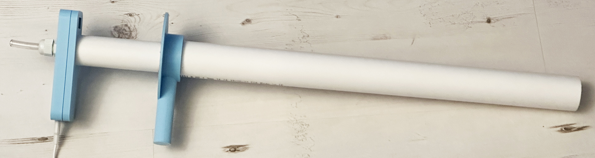
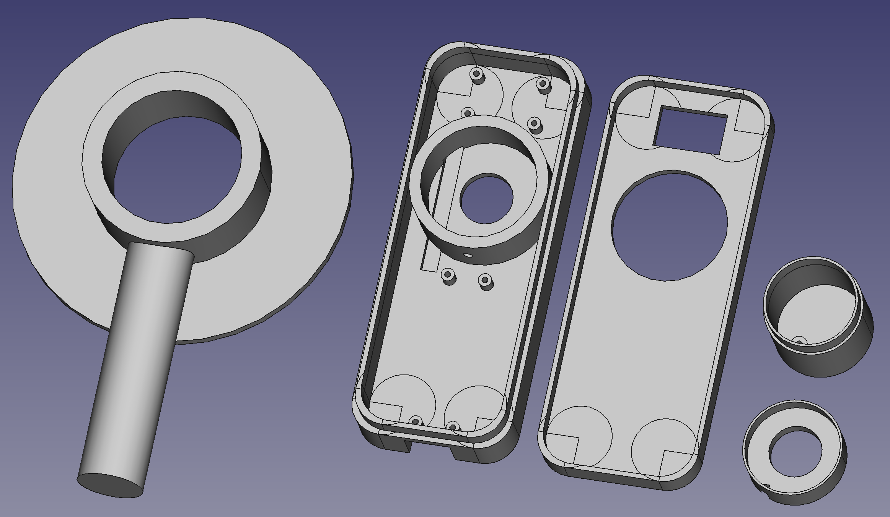

# PICO Trombone controller

Designs and software for a trombone controller.

## Controlling a mouse with trombone action

The controller can be used to play the game Trombone Champ: https://www.trombonechamp.com/

It replaces the mouse controller. There is a breath controlled version which uses a BMP280 pressure sensor and a button controlled version. 

You will need:

* A Raspberry Pi PICO
* A VL53L4CD time of flight sensor
* A BMP280 temperature and pressure sensor or two pushbuttons that will fit in 12mm diameter holes
* 45 cm of 32mm diameter waste pipe
* 45 cm of 40mm diameter waste pipe
* A micro-USB cable to link the PICO to the host
* Connecting wire. The author used coloured wire wrap (search for "30 AWG wire wrap") which needed a wire wrap tool (search for "wire wrap tool")..
* A case and target. There is a 3D printable set one which fits around the tubing and works well.
* PG9 cable gland for the mouthpiece connector if you are using the BMP280
* 8mm clear vinyl tubing for the mouthpiece. You’ll need a length of around 50mm for each mouthpiece. 
* Screws. You'll need some screws size M2 4mm in length to fix the environmental sensor and PICO to the case (search for "laptop screws").

## Circuit Diagram

The diagram shows the connection for both buttons and air pressur sensor. Ignore the one you're not using. 

## Software Installation

Install Circuit Python 7.0 on your PICO and then copy the lib folder and the code.py file to the PICO. When you power on the PICO it will then run the code. You may need to edit the code.py file to select the input method you are using. 

## Case

The components for the case can be found in the case folder. 

Enjoy playing your trombone
Rob Miles